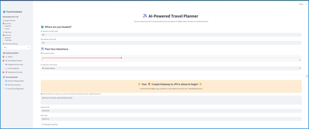
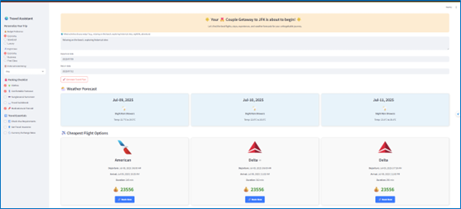
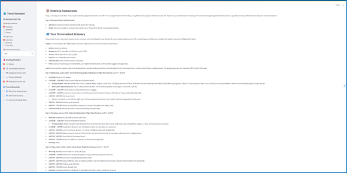
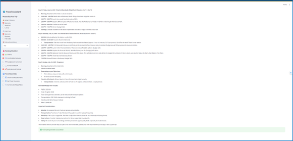

# AI-Powered Travel Planner

## Overview
The **AI-Powered Travel Planner** is a Streamlit-based web application designed to help users plan personalized trips with ease. It integrates APIs and AI agents to provide tailored travel recommendations, including flights, hotels, activities, and weather forecasts, based on user preferences such as budget, travel theme, and activity interests.

## Features
- **Flight Search**: Fetches and displays the top 3 cheapest flight options using the SerpApi Google Flights engine.
- **Weather Forecast**: Retrieves weather data for the destination using the Open-Meteo API, displaying daily forecasts with temperature and conditions.
- **Personalized Itinerary**: Generates a detailed travel itinerary using AI agents powered by the Gemini model, incorporating user preferences and weather conditions.
- **Hotel & Restaurant Recommendations**: Suggests highly rated hotels and restaurants based on the destination and user preferences.
- **Interactive UI**: Offers a user-friendly interface with inputs for departure/destination IATA codes, travel dates, budget, and activity preferences.
- **Packing Checklist & Travel Essentials**: Includes a sidebar for managing travel essentials like visa requirements, travel insurance, and packing lists.

{:.center-image}
{:.center-image}
{:.center-image}
{:.center-image}


## Prerequisites
- Python 3.8+
- Streamlit
- Required Python packages (install via `requirements.txt`):
  - `streamlit`
  - `pandas`
  - `requests`
  - `base64`
  - `serpapi`
  - `python-dateutil`
- API Keys:
  - SerpApi key for flight and hotel/restaurant searches
  - Google API key for the Gemini model
- SVG icon assets for weather display (place in an `assets/` folder)

## Installation
1. **Clone the Repository**:
   ```bash
   git https://github.com/CongHoanCoder/GenAI_Summer_Course/tree/main/03_Course_Project
   cd 03_Course_Project
   ```

2. **Install Dependencies**:
   ```bash
   pip install -r requirements.txt
   ```

3. **Set Up Environment Variables**:
   - Create a `.env` file or configure Streamlit secrets with the following:
     ```plaintext
     SERPAPI_KEY=your_serpapi_key
     GOOGLE_API_KEY=your_google_api_key
     ```
   - Alternatively, replace `SERPAPI_KEY` and `GOOGLE_API_KEY` in the code with your keys (not recommended for production).

4. **Add SVG Assets**:
   - Place weather icon SVG files (e.g., `clear.svg`, `rain.svg`) in an `assets/` folder in the project directory.

5. **Run the Application**:
   ```bash
   streamlit run app.py
   ```

## Usage
1. **Launch the App**:
   - Run the Streamlit command above to start the app in your browser (typically at `http://localhost:8501`).

2. **Input Travel Details**:
   - Enter departure and destination IATA codes (e.g., `SDF` for Louisville, `JFK` for New York).
   - Select trip duration, travel theme, and activity preferences.
   - Choose departure and return dates.
   - Customize preferences in the sidebar (budget, flight class, hotel rating, etc.).

3. **Generate Travel Plan**:
   - Click the "Generate Travel Plan" button to fetch and display:
     - Weather forecasts for the destination.
     - Cheapest flight options with booking links.
     - Hotel and restaurant recommendations.
     - A personalized itinerary tailored to your preferences.

4. **Review Results**:
   - Explore weather cards, flight options, and AI-generated recommendations.
   - Use the provided booking links for flights or follow hotel/restaurant suggestions.

## Project Structure
```plaintext
├── travelagent.py                # Main Streamlit application script
├── assets/               # Folder for weather icon SVG files
├── requirements.txt      # Python dependencies
└── README.md             # This file
```

## API Dependencies
- **SerpApi**: Used for flight and hotel/restaurant searches. Requires a valid API key.
- **Open-Meteo**: Provides weather forecasts (no API key required).
- **Google Gemini**: Powers the AI agents for research, planning, and recommendations. Requires a Google API key.

## Notes
- **IATA Codes**: Ensure valid IATA codes are used for departure and destination airports. The app uses the OpenFlights dataset for airport data.
- **Weather Forecast Limitations**: Forecasts are limited to 7 days from the current date due to Open-Meteo API constraints.
- **API Key Security**: Store API keys securely in environment variables or Streamlit secrets to avoid exposing them in the codebase.
- **Customization**: Modify the `WEATHER_CODE_MAP` dictionary or add new SVG icons to enhance weather display options.

## Limitations
- Requires internet access for API calls.
- Weather forecasts are limited to 7 days, which may affect long-term trip planning.
- API key configuration is mandatory for full functionality.
- SVG icons must be present in the `assets/` folder for weather visuals to display correctly.

